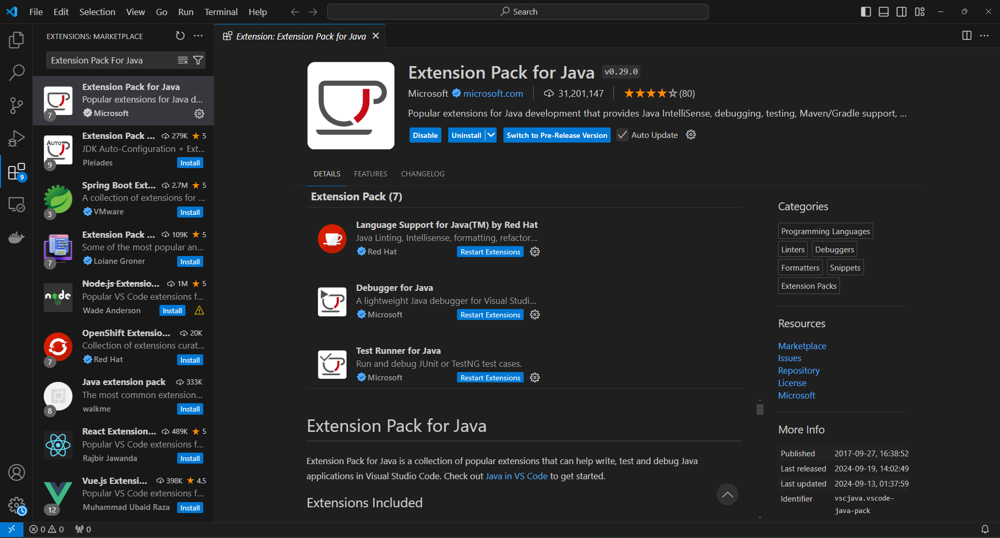
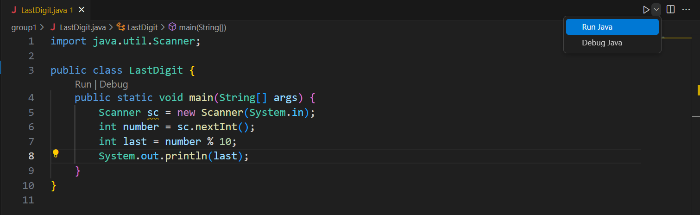
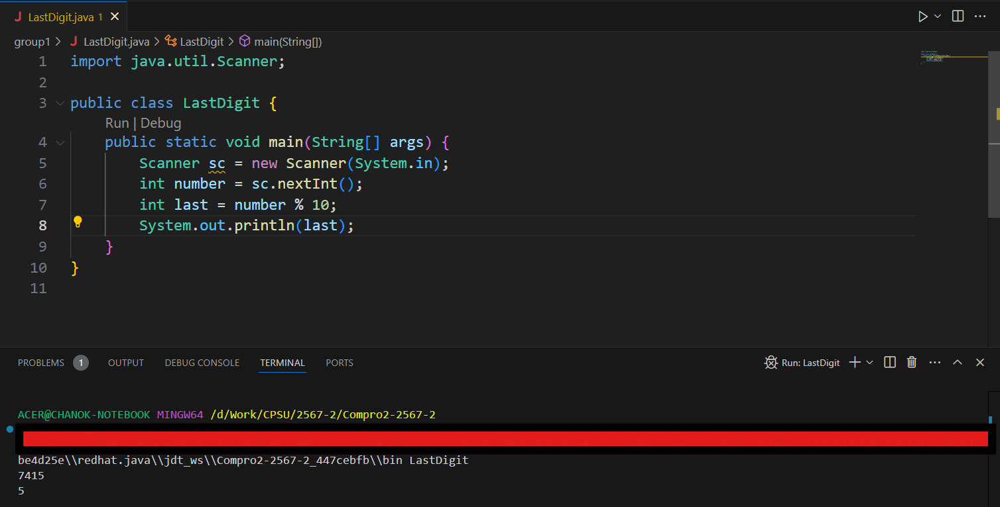

# วิชา COMPUTER PROGRAMMING SKILL II (2/2567)

## สารบัญ

- [การติดตั้งเครื่องมือ](#การติดตั้งเครื่องมือ)

### การติดตั้งเครื่องมือ

1. ติดตั้ง Vscode (https://code.visualstudio.com/download)
1. ติดตั้ง Extension

    - Extension Pack for Java
        

1. สร้างไฟล์ .java และกด "run java"

    

1. กรอกข้อมูลเข้าและดูผลลัพธ์

    

### ผู้เขียน

- นายชนก ปฐมเพทาย (cpathompatai@gmail.com)
